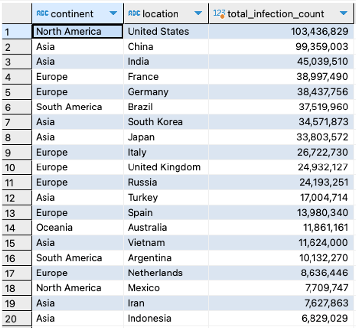
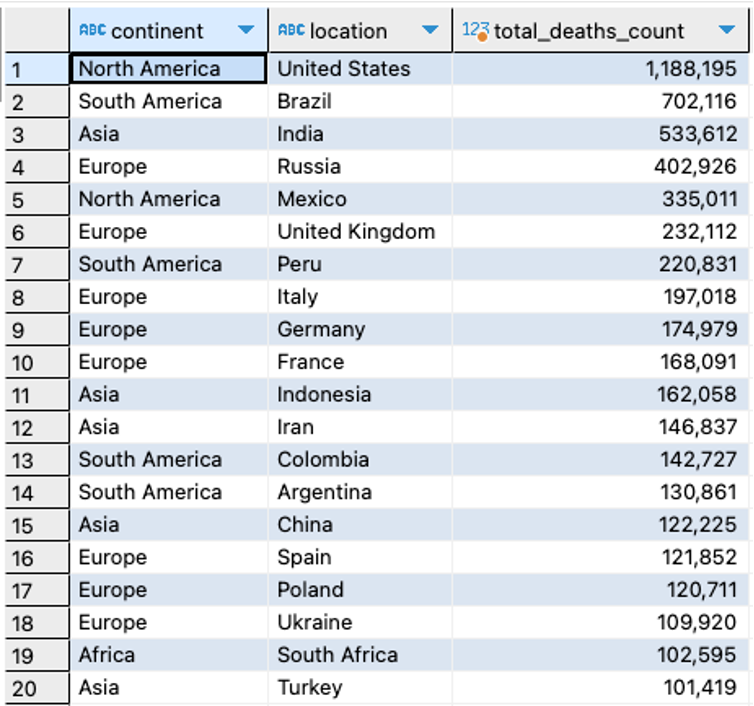
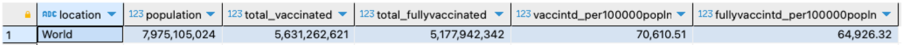
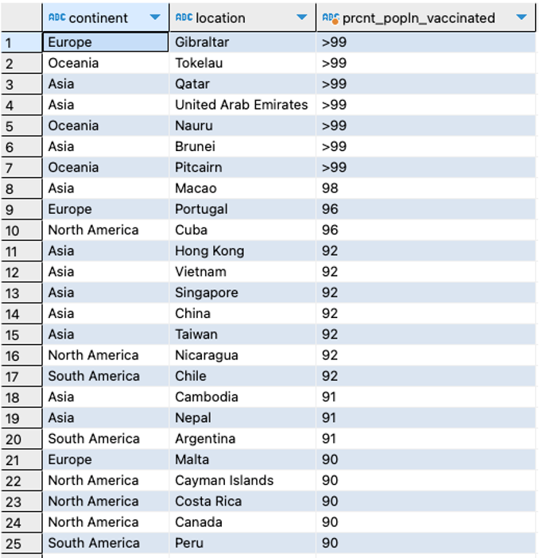
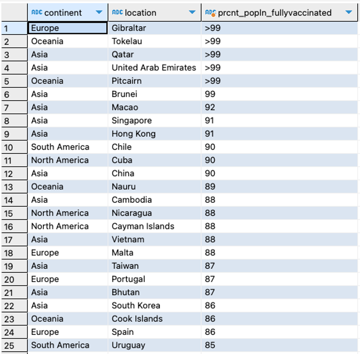

<br>
<br>

#### Overview

The goal of this project is to analyze the COVID-19 deaths and vaccinations dataset to derive valuable insights and trends that can help understand the impact of COVID-19 virus globally. 
<br><br>

#### Data Collection

The dataset was sourced from [Our World in Data](https://ourworldindata.org/covid-deaths) (*see complete attribution at the end*) with date range from 05 January 2020 to 26 May 2024. The downloaded dataset was split into 2 files: *(1) coviddeaths*; and *(2) covidvaccinations*. Both were in csv files.
<br><br>

#### Importing Data 

This project was carried out using DBeaver connected to PostgreSQL database which was used to import the data and perform SQL queries. 
<br><br> 

#### Data preprocessing

Before exploring the data, the following were done.

```sql
/* check the number of rows (records) in the dataset */ 
SELECT count(*)
FROM coviddeaths;

/* add a new column date with datatype as date (the existing date column has a datatype of varchar) */ 
ALTER TABLE coviddeaths RENAME COLUMN "date" TO date_orig;
ALTER TABLE coviddeaths ADD COLUMN reporting_date date;
UPDATE coviddeaths SET reporting_date = TO_DATE(date_orig, 'DD/MM/YYYY');

ALTER TABLE covidvaccinations RENAME COLUMN "date" TO date_orig;
ALTER TABLE covidvaccinations ADD COLUMN reporting_date date;
UPDATE covidvaccinations SET reporting_date = TO_DATE(date_orig, 'DD/MM/YYYY');
```
<br>


####  Data exploration (Questions)

SQL queries were used to answer questions to give insights on the impact of COVID-19 globally.
<br>

**Question 1:** Determine COVID infection rates (Total cases vs population, or the percentage of population that contracted COVID19) worldwide, by country, by region/continent. Show the highest or top 10. 

```sql
-- create a view for the infection rates
CREATE OR REPLACE VIEW infectionRates 
AS
SELECT 
	continent,
	location,
	reporting_date,
	population,
	total_cases,
	ROUND(CAST(total_cases AS DECIMAL) / population * 100, 2) AS percent_population_infected
FROM coviddeaths
WHERE total_cases IS NOT NULL;
```
<br>

```sql
-- Q1a: Latest worldwide infection rates
SELECT 
	location,
	population,
	MAX(total_cases) AS total_infection_count,
	MAX(ROUND(CAST(total_cases AS DECIMAL) / population * 100, 2)) AS percent_population_infected
FROM infectionRates 
WHERE location = 'World'
GROUP BY location, population;
```


<br>

```sql
-- Q1b: Latest infection rates by region/continent (highest to lowest)
SELECT 
	continent,
	sum(population) AS continent_population,
	sum(total_infection_count) AS continent_total_cases,
	ROUND(CAST(sum(total_infection_count) AS DECIMAL) / sum(population) * 100, 2) AS continent_pcnt_pop_infected
FROM
	(SELECT 
		continent, 
		location, 
		population, 
		MAX(total_cases) AS total_infection_count
	FROM infectionRates 
	WHERE continent <> '' 
	GROUP BY continent, location, population)
GROUP BY continent
ORDER BY continent_pcnt_pop_infected DESC;
```


<br>

```sql
-- Q1c: Top 20 countries/locations with highest number of COVID cases
SELECT 
	continent,
	location,
	MAX(total_cases) AS total_infection_count
FROM infectionRates 
WHERE continent <> '' 
GROUP BY continent, location
ORDER BY total_infection_count DESC
LIMIT 20;
```


<br>

```sql
-- Q1d: Top 20 countries/locations with highest (latest) infection rates 
SELECT 
	continent, 
	location, 
	population, 
	MAX(total_cases) AS total_infection_count,
	MAX(ROUND(CAST(total_cases AS DECIMAL) / population * 100, 2)) AS percent_population_infected
FROM infectionRates 
WHERE continent <> '' 
GROUP BY continent, location, population
ORDER BY percent_population_infected DESC
LIMIT 20;
```


<br>
<br>

**Question 2:** Determine COVID case fatality rates (Total deaths vs total cases, or the percentage of deaths in relation to the number of cases) worldwide, by country, by region/continent. Show the highest or top 10.

```sql
-- create a view for the infection rates
CREATE OR REPLACE VIEW caseFatalityRates 
AS
SELECT 
	continent,
	location,
	reporting_date,
	population,
	total_cases,
	total_deaths,
	ROUND(CAST(total_deaths AS DECIMAL) / total_cases * 100, 2) AS case_fatality_rate
FROM coviddeaths
WHERE total_cases IS NOT NULL;
```
<br>

```sql
-- Q2a: Latest worldwide case fatality rates for COVID
SELECT 
	location,
	MAX(total_cases) AS total_cases_count,
	MAX(total_deaths) AS total_deaths_count,
	ROUND(CAST(MAX(total_deaths) AS DECIMAL) / MAX(total_cases) * 100, 2) AS case_fatality_rate
FROM caseFatalityRates 
WHERE location = 'World'
GROUP BY location;
```


<br>

```sql
-- Q2b: Latest case fatality rates by region/continent (highest to lowest)
SELECT 
	continent,
	sum(total_cases_count) AS continent_total_cases,
	sum(total_deaths_count) AS continent_total_deaths,
	ROUND(CAST(SUM(total_deaths_count) AS DECIMAL) / SUM(total_cases_count) * 100, 2) AS continent_case_fatality_rate
FROM
	(SELECT 
		continent, 
		location, 
		MAX(total_cases) AS total_cases_count,
		MAX(total_deaths) AS total_deaths_count
	FROM caseFatalityRates 
	WHERE continent <> '' 
	GROUP BY continent, location)
GROUP BY continent
ORDER BY continent_case_fatality_rate DESC;
```


<br>

```sql
-- Q2c: Top 20 countries/locations with highest number of deaths due to COVID 
SELECT 
	continent, 
	location, 
	MAX(total_deaths) AS total_deaths_count
FROM caseFatalityRates 
WHERE continent <> '' AND total_deaths IS NOT NULL
GROUP BY continent, location
ORDER BY total_deaths_count DESC
LIMIT 20;
```


<br>

```sql
-- Q2d: Top 20 countries/locations with highest (latest) case fatality rates 
SELECT 
	continent, 
	location, 
	MAX(total_cases) AS total_cases_count,
	MAX(total_deaths) AS total_deaths_count,
	ROUND(CAST(MAX(total_deaths) AS DECIMAL) / MAX(total_cases) * 100, 2) AS case_fatality_rate
FROM caseFatalityRates 
WHERE continent <> '' AND total_deaths IS NOT NULL
GROUP BY continent, location
ORDER BY case_fatality_rate DESC
LIMIT 20;
```


<br>

```sql
-- Q2e: Latest worldwide mortality rates for COVID (deaths per 100,0000 population)
SELECT 
	location,
	MAX(population) as population,
	MAX(total_deaths) AS total_deaths_count,
	ROUND(CAST(MAX(total_deaths) AS DECIMAL) / MAX(population) * 100000, 2) AS deaths_per100000popln
FROM caseFatalityRates 
WHERE location = 'World'
GROUP BY location;
```


<br>

```sql
-- Q2f: Death counts per population  by region/continent (highest to lowest)
SELECT 
	continent,
	sum(loc_population) AS continent_total_population,
	sum(total_deaths_count) AS continent_total_deaths,
	ROUND(CAST(SUM(total_deaths_count) AS DECIMAL) / SUM(loc_population) * 100000, 2) AS deaths_per100000popln
FROM
	(SELECT 
		continent, 
		location, 
		MAX(population) as loc_population,
		MAX(total_deaths) AS total_deaths_count
	FROM caseFatalityRates 
	WHERE continent <> '' 
	GROUP BY continent, location)
GROUP BY continent
ORDER BY deaths_per100000popln DESC;
```


<br>

```sql
-- Q2g: Top 20 Death counts per population  by country (highest to lowest)
SELECT 
	continent, 
	location, 
	MAX(population) as population,
	MAX(total_deaths) AS total_deaths_count,
	ROUND(CAST(MAX(total_deaths) AS DECIMAL) / MAX(population) * 100000, 2) AS deaths_per100000popln
FROM caseFatalityRates 
WHERE continent <> '' AND total_deaths IS NOT NULL
GROUP BY continent, location
ORDER BY deaths_per100000popln DESC
LIMIT 20;
```


<br>
<br>

**Question 3:** Determine the global (world) cases per day. Determine when high percent of new deaths per new cases were recorded globally 

<br>

 ```sql
/* Global cases per day */
CREATE OR REPLACE VIEW new_cases_deaths_perday 
AS
SELECT 
	reporting_date, 
	SUM(new_cases) AS new_cases_count,
	SUM(new_deaths) AS new_deaths_count,
	CASE 
		WHEN SUM(new_cases) <>  0 THEN ROUND(CAST(SUM(new_deaths) AS DECIMAL) / SUM(new_cases) * 100, 2)
		ELSE NULL
	END AS percent_newdeaths_per_newcases
FROM coviddeaths
WHERE location = 'World' AND new_cases > new_deaths
GROUP BY reporting_date; 
```
<br>

```sql
/* Days with Highest percent of new deaths per new cases recorded globally */
SELECT *
FROM 
	(SELECT * 
	FROM new_cases_deaths_perday
	ORDER BY percent_newdeaths_per_newcases DESC
	LIMIT 20)
ORDER BY reporting_date; 
```


<br>
<br>

**Question 4:** Determine the rolling count of vaccinations. Use new_vaccinations data. 

<br>

```sql
CREATE OR REPLACE VIEW rollingCountVaccinations AS
WITH poplnVaccinated 
	(continent, 
	location, 
	reporting_date,
	population,
	new_vaccinations,
	rolling_num_of_vaccinations)
AS
(SELECT 
	cd.continent,
	cd.location,
	cd.reporting_date,
	cd.population,
	cv.new_vaccinations,
	SUM(cv.new_vaccinations) OVER (PARTITION BY cd.location ORDER BY cd.location, cd.reporting_date)
		AS rolling_num_of_vaccinations
FROM coviddeaths cd
JOIN covidvaccinations cv
	ON cd.location = cv.location AND cd.reporting_date = cv.reporting_date
)
SELECT *,
	ROUND(CAST(rolling_num_of_vaccinations AS DECIMAL) / population * 100000, 2) AS total_vaccinations_per100Kpopln
FROM poplnVaccinated;
```
<br>

```sql
-- Q4a: Worldwide number of COVID vaccinations
SELECT 
	location,
	MAX(population) AS population,
	MAX(rolling_num_of_vaccinations) AS total_vaccinations,
	MAX(total_vaccinations_per100kpopln) AS total_vaccinations_per100kpopln
FROM rollingCountVaccinations 
WHERE location = 'World'
GROUP BY location;
```


<br>

```sql
-- Q4b: Top 20 countries/locations with highest numbervaccinations 
SELECT 
	continent, 
	location, 
	MAX(population) AS population,
	MAX(rolling_num_of_vaccinations) AS total_vaccinations,
	MAX(total_vaccinations_per100kpopln) AS total_vaccinations_per100kpopln
FROM rollingCountVaccinations
WHERE continent <> '' AND rolling_num_of_vaccinations IS NOT NULL
GROUP BY continent, location 
ORDER BY total_vaccinations DESC
LIMIT 20;
```


<br>
<br>

**Question 5:** Determine the vaccination rate or the percentage  of population that has received at least one covid vaccine worldwide, by country, by region/continent. Show the highest or top 10. 
<br>

```sql
-- create a view for the vaccination rates
CREATE OR REPLACE VIEW vaccinationTable 
AS
SELECT 
	continent,
	location,
	reporting_date,
	population,
	people_vaccinated,
	people_fully_vaccinated,
	new_people_vaccinated_smoothed
FROM covidvaccinations; 
```
<br>

```sql
-- Q5a: Latest worldwide COVID vaccination rate (people vaccinated per 100000 population)
SELECT 
	location,
	MAX(population) AS population,
	MAX(people_vaccinated) AS total_vaccinated,
	MAX(people_fully_vaccinated) AS total_fullyvaccinated,
	ROUND(CAST(MAX(people_vaccinated) AS DECIMAL) / MAX(population) * 100000, 2) AS vaccintd_per100000popln,
	ROUND(CAST(MAX(people_fully_vaccinated) AS DECIMAL) / MAX(population) * 100000, 2) AS fullyvaccintd_per100000popln
FROM vaccinationTable 
WHERE location = 'World'
GROUP BY location;
```


<br>

```sql
-- Q5b: Latest vaccinated rates (people vaccinated per 100000 population) by region/continent (highest to lowest)
SELECT 
	continent,
	sum(population) AS cont_population,
	sum(total_vaccinated) AS cont_total_vaccinated,
	ROUND(CAST(SUM(total_vaccinated) AS DECIMAL) / SUM(population) * 100000, 2) AS vaccntd_per100000popln
FROM
	(SELECT 
		continent, 
		location, 
		MAX(population) AS population,
		MAX(people_vaccinated) AS total_vaccinated
	FROM vaccinationTable
	WHERE continent <> '' 
	GROUP BY continent, location)
GROUP BY continent
ORDER BY vaccntd_per100000popln DESC;
```


<br>

```sql
-- Q5c: Latest fully vaccinated rates (people fully vaccinated per 100000 population) by region/continent (highest to lowest)
SELECT 
	continent,
	sum(population) AS cont_population,
	sum(total_fullyvaccinated) AS cont_total_fullyvaccinated,
	ROUND(CAST(SUM(total_fullyvaccinated) AS DECIMAL) / SUM(population) * 100000, 2) AS fully_vaccntd_per100000popln
FROM
	(SELECT 
		continent, 
		location, 
		MAX(population) AS population,
		MAX(people_fully_vaccinated) AS total_fullyvaccinated
	FROM vaccinationTable
	WHERE continent <> '' 
	GROUP BY continent, location)
GROUP BY continent
ORDER BY fully_vaccntd_per100000popln DESC;
```


<br>

```sql
-- Q5d: Top 25 with high vaccinated rates (people vaccinated per 100000 population)  by country (highest to lowest)
SELECT 
	continent,
	location,
	CASE 
		WHEN total_vaccinated < population THEN prcnt_popln_vaccntd
		ELSE '>99'
	END AS prcnt_popln_vaccinated
FROM
(SELECT 
	continent, 
	location, 
	MAX(population) AS population,
	MAX(people_vaccinated) AS total_vaccinated,
	ROUND(CAST(MAX(people_vaccinated) AS DECIMAL) / MAX(population) * 100, 0) AS prcnt_popln_vaccntd_num,
	CAST(ROUND(CAST(MAX(people_vaccinated) AS DECIMAL) / MAX(population) * 100, 0) AS VARCHAR) AS prcnt_popln_vaccntd
FROM vaccinationTable 
WHERE continent <> '' AND people_vaccinated IS NOT NULL
GROUP BY continent, location
ORDER BY prcnt_popln_vaccntd_num DESC
LIMIT 25);
```


<br>

```sql
-- Q5e: Top 25 with high fully vaccinated rates (people fully vaccinated per 100000 population)  by country (highest to lowest)
SELECT 
	continent,
	location,
	CASE 
		WHEN total_fullyvaccinated < population THEN prcnt_popln_fullyvaccntd
		ELSE '>99'
	END AS prcnt_popln_fullyvaccinated
FROM
(SELECT 
	continent, 
	location, 
	MAX(population) AS population,
	MAX(people_fully_vaccinated) AS total_fullyvaccinated,
	ROUND(CAST(MAX(people_fully_vaccinated) AS DECIMAL) / MAX(population) * 100, 0) AS prcnt_popln_fullyvaccntd_num,
	CAST(ROUND(CAST(MAX(people_fully_vaccinated) AS DECIMAL) / MAX(population) * 100, 0) AS VARCHAR) AS prcnt_popln_fullyvaccntd
FROM vaccinationTable 
WHERE continent <> '' AND people_fully_vaccinated IS NOT NULL
GROUP BY continent, location
ORDER BY prcnt_popln_fullyvaccntd_num DESC
LIMIT 25);
```


<br>

#### Visualization

The views generated from the queries above were exported as csv files for visualization using Tableau. This can be viewed [here](https://public.tableau.com/views/Covid_deaths_17194860048630/Dashboard1?:language=en-US&:sid=&:display_count=n&:origin=viz_share_link). 

<br>
<br>
##### Data source attribution:

*Edouard Mathieu, Hannah Ritchie, Lucas Rodés-Guirao, Cameron Appel, Charlie Giattino, Joe Hasell, Bobbie Macdonald, Saloni Dattani, Diana Beltekian, Esteban Ortiz-Ospina and Max Roser (2020) - "Coronavirus Pandemic (COVID-19)". Published online at OurWorldInData.org. Retrieved from: 'https://ourworldindata.org/coronavirus' [Online Resource]*

<br>
<br>
<br>
<br>


